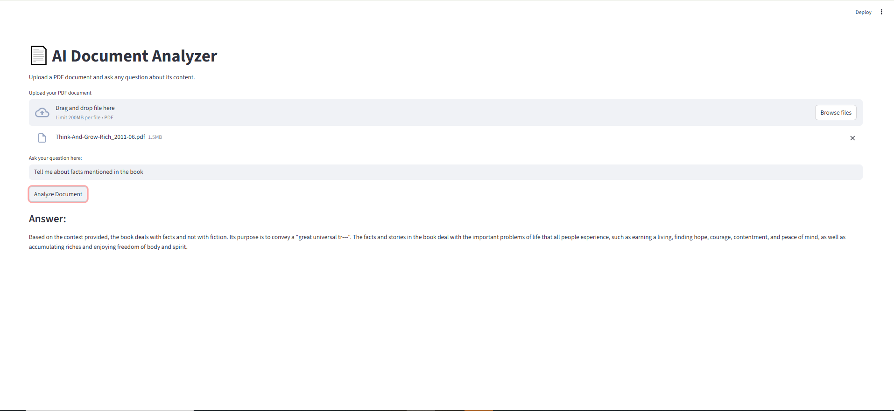

# AI Document Analyzer (RAG + Gemini)

## 🚀 Live App

*[Your Live App Link Will Go Here After Deployment]*

---

## 📝 Overview

This project is an intelligent web application that can read and answer questions about any uploaded PDF document. It leverages a **Retrieval-Augmented Generation (RAG)** pipeline to ensure the AI's answers are factually grounded in the content of the document.

The app is built with Python, using Streamlit for the user interface and Google's Gemini Pro for the final answer generation.

---

## 🛠️ Technologies Used

* **Python & Streamlit:** For the application and user interface.
* **Google Gemini Pro:** For generating answers based on context.
* **Sentence-Transformers:** For creating high-quality text embeddings locally.
* **NumPy:** For performing efficient similarity searches.
* **PyMuPDF:** For robustly extracting text from PDF documents.

---

## ▶️ How to Run Locally

1.  **Clone the repository.**
2.  **Create and activate a virtual environment.**
3.  **Install dependencies:** `pip install -r requirements.txt`
4.  **Set your API key** as an environment variable (`export GEMINI_API_KEY='...'`).
5.  **Run the app:** `streamlit run app.py`